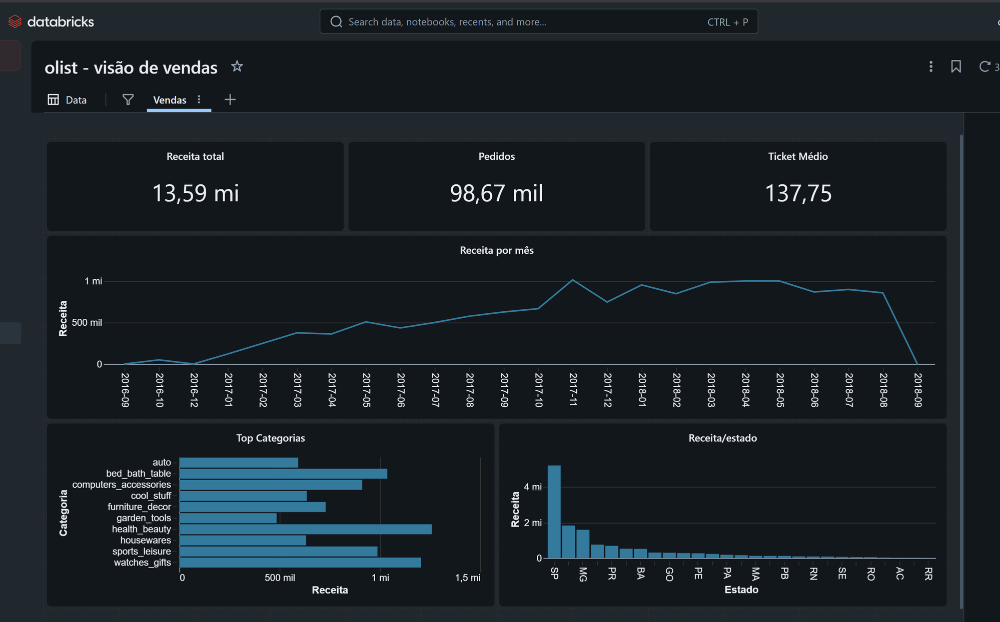

# databricks-medallion-olist

Pipeline de dados end-to-end em **arquitetura Medallion** (bronze → silver → gold) sobre o **Azure**, usando **Databricks + Delta Lake + Unity Catalog**, com dados reais de e-commerce brasileiro (dataset Olist).

> 🚧 Em construção — projeto de portfólio, evoluindo por fases.

## Objetivo

Modelar um lakehouse completo a partir de dados transacionais crus (estilo OLTP) até um **star schema** pronto pra consumo em BI — mostrando ingestão, limpeza, modelagem dimensional, orquestração e governança.

## Stack

| Camada | Ferramenta |
|---|---|
| Data lake | Azure Data Lake Storage Gen2 |
| Processamento | Azure Databricks (Spark / PySpark) |
| Formato de tabela | Delta Lake |
| Governança | Unity Catalog |
| Orquestração | Databricks Workflows |
| Consumo | Power BI / Databricks SQL |

## Arquitetura

```
Olist (OLTP normalizado)
      │  ingestão
      ▼
   BRONZE  ── dado cru em Delta
      │  limpeza, tipagem, dedup
      ▼
   SILVER  ── dado confiável
      │  modelagem dimensional
      ▼
    GOLD   ── star schema (fato + dimensões)
      │
      ▼
  Power BI / Databricks SQL
```

## Dashboard

Visão de vendas sobre a camada gold (Databricks SQL Dashboard):



## Status por fase

- [x] Fase 0 — setup (conta, repo, ferramentas)
- [x] Fase 1 — infra (ADLS Gen2, workspace, Unity Catalog)
- [x] Fase 2 — dados de origem (Olist)
- [x] Fase 3 — bronze
- [x] Fase 4 — silver
- [x] Fase 5 — gold (star schema)
- [x] Fase 6 — orquestração + governança
- [x] Fase 7 — dashboard
- [ ] Fase 8 — documentação final

## Notas sobre os dados (Olist)

O dataset reflete a história real do marketplace — importante ao ler o dashboard. Os gráficos mostram a série **completa, sem recorte** (transparência); os KPIs de total usam todo o dataset.

- **set/2016:** só 4 pedidos.
- **out/2016:** "burst" de ~324 pedidos concentrado em 3–10/out (lançamento-piloto).
- **nov/2016:** nenhum pedido.
- **dez/2016:** 1 pedido isolado (R$ 10,90).
- **jan/2017 em diante:** operação real, crescendo até ~7,5k pedidos/mês (pico em nov/2017).
- **set–out/2018:** queda abrupta (16 e 4 pedidos) — é o **corte da extração** do dataset, não queda de vendas.

**Validação:** as contagens batem com a fonte (**99.441 pedidos / 112.650 itens**) e com EDAs públicas do dataset (~329 pedidos em 2016). Ou seja, o pipeline é fiel à origem — o "estranho" é o negócio real.
