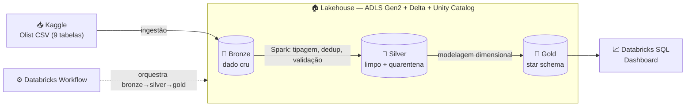
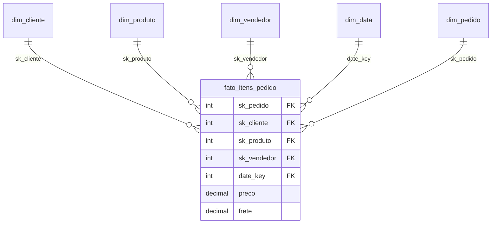

# 🛒 Lakehouse Medallion na Azure — Olist E-Commerce

> Pipeline de dados **end-to-end** que leva ~100 mil pedidos reais de e-commerce brasileiro do CSV cru até um dashboard de vendas — em arquitetura **Medallion** (bronze → silver → gold) sobre **Azure Databricks**, com governança de verdade no **Unity Catalog**.


---

## 🎯 Em uma frase

Peguei um dataset transacional **normalizado** (estilo OLTP) e construí um **lakehouse governado** que o transforma, camada a camada, num **star schema** pronto pra BI — com ingestão, limpeza + quarentena de qualidade, modelagem dimensional, orquestração e um dashboard no fim.

## 📊 O resultado


*R$ 13,6 mi em receita · ~99 mil pedidos · ticket médio R$ 137 — SP domina, categorias health_beauty e watches_gifts no topo.*

## 🏗️ Arquitetura



## 🧰 Stack

| Camada | Ferramenta |
|---|---|
| Data lake | Azure Data Lake Storage Gen2 (HNS) |
| Processamento | Azure Databricks · Spark / PySpark (serverless) |
| Formato de tabela | Delta Lake |
| Governança | Unity Catalog (managed identity, external locations, grants) |
| Orquestração | Databricks Workflows |
| Consumo | Databricks SQL Dashboard |
| IaC / reprodutibilidade | Azure CLI + Databricks Asset Bundle |

## 🥉🥈🥇 Como funciona (Medallion)

- **Bronze** — os 9 CSVs do Olist viram tabelas Delta **sem limpeza**, só com metadados de ingestão. Ganha ACID, schema e time travel sobre o cru.
- **Silver** — tipagem explícita, padronização, **dedup** e **quarentena**: cada tabela separa linhas válidas de reprovadas (`<tabela>_quarantine` com o motivo), sem quebrar o pipeline nem contaminar o dado.
- **Gold** — **star schema** desnormalizado: fato `fato_itens_pedido` (grão = item de pedido) + 5 dimensões (`cliente`, `produto`, `vendedor`, `data`, `pedido`) com **surrogate keys**.

### Modelo dimensional (gold)



## ⭐ Destaques técnicos

- **Governança sem chave:** acesso ao storage via **managed identity** (Access Connector) + RBAC; no Unity Catalog, a cadeia *storage credential → external location → catalog/schema* com as managed locations apontando pro próprio ADLS.
- **Qualidade com quarentena:** validação declarativa por tabela (chave nula, domínio inválido, data ausente) — engenharia defensiva, não quebra em dado ruim.
- **Modelagem dimensional:** star schema com surrogate keys e checagem de **integridade referencial** (0 órfãos) na gold.
- **Orquestração idempotente:** um job encadeia as 3 camadas; como cada etapa reescreve sua camada, é seguro reexecutar.
- **Rigor com o dado:** um número suspeito no dashboard virou uma investigação até a origem — provei que o pipeline era fiel e documentei em vez de recortar a série (ver *Notas sobre os dados*).

## 🧭 Decisões de arquitetura

| Decisão | Escolha | Por quê |
|---|---|---|
| Plataforma | Azure Databricks | Lakehouse gerenciado (Spark + Delta + UC integrados) na própria conta Azure |
| Compute dos notebooks | **Serverless** (não cluster clássico) | Liga/desliga na hora, sem *idle burn* — custo mínimo no free tier |
| Acesso ao storage | **Managed identity** (não chave/SAS) | Sem segredo em lugar nenhum; acesso governado pelo Unity Catalog |
| Modelo da gold | **Star schema** (não snowflake) | Dimensões desnormalizadas = menos joins, leitura rápida pra BI |
| Chaves das dimensões | **Surrogate keys** | Join por inteiro, independência da fonte, base pra SCD futuro |
| Qualidade na silver | **Quarentena** (não descartar nem quebrar) | Preserva o dado ruim pra análise sem contaminar nem derrubar o pipeline |
| Orquestração | **Databricks Workflows** (não Airflow) | Tudo vive no Databricks; sem infra externa pra manter |
| Integridade referencial | Checada na **gold** | É onde os joins acontecem — órfãos aparecem ali (validado: 0) |

## 📁 Estrutura do repositório

```
infra/       # provisionamento Azure via az CLI (RG, ADLS, workspace, access connector)
setup/       # bootstrap do Unity Catalog (SQL) + definição do workflow + queries do dashboard
notebooks/   # bronze / silver / gold (PySpark)
docs/        # imagens (diagrama, dashboard)
```

## ▶️ Como reproduzir

1. **Infra (Azure):** rodar os scripts de `infra/` em ordem (`01`…`06`) — cria RG, ADLS Gen2, workspace Databricks e o Access Connector.
2. **Unity Catalog:** rodar `setup/01_unity_catalog.sql` (external locations + catalog + schemas).
3. **Dados:** `setup/02_dados_origem.sh` baixa o Olist (Kaggle) e sobe pro bronze.
4. **Pipeline:** rodar o job `medallion-olist-pipeline` (definido em `setup/03_workflow.yml`) — executa bronze → silver → gold.
5. **Dashboard:** queries em `setup/04_dashboard_queries.sql`.

> 💰 Projeto feito na conta **Azure Free**. Ao terminar, `az group delete -n rg-medallion-olist` derruba tudo e zera o custo — a infra é 100% reproduzível pelos scripts.

## 🗃️ Dados

**Brazilian E-Commerce Public Dataset by Olist** (Kaggle) — ~100 mil pedidos reais (set/2016 a out/2018), em 9 tabelas normalizadas.
Fonte: https://www.kaggle.com/datasets/olistbr/brazilian-ecommerce

### Notas sobre os dados

Os gráficos mostram a série **completa, sem recorte** (transparência); os KPIs usam todo o dataset.

- **2016:** só ~329 pedidos — piloto em out/2016 (burst de uma semana), gap em nov, 1 pedido em dez.
- **2017–2018:** operação real, crescendo até ~7,5 mil pedidos/mês (pico em nov/2017).
- **set–out/2018:** queda abrupta — é o **corte da extração** do dataset, não queda de vendas.

Validação: as contagens batem com a fonte (**99.441 pedidos / 112.650 itens**) e com EDAs públicas — o pipeline é fiel à origem.
